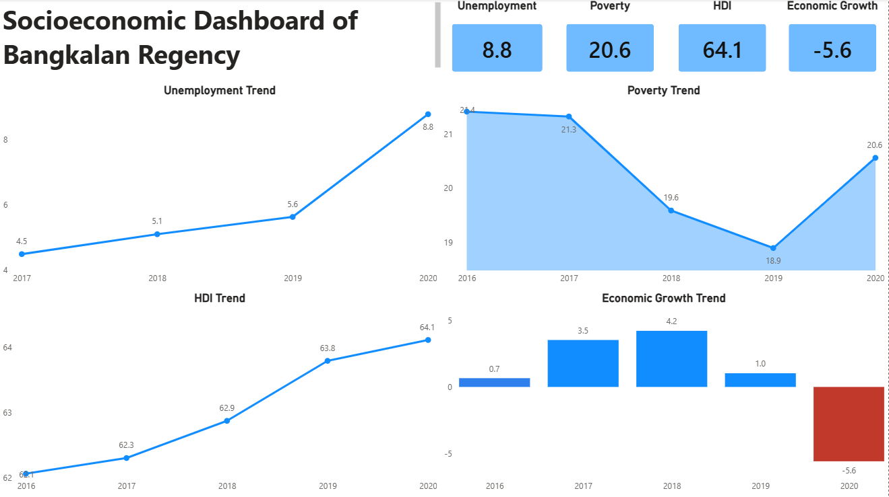

# Bangkalan Socioeconomic Dashboard

Interactive Power BI dashboard analyzing socioeconomic indicators in Bangkalan Regency using BPS data (2016–2020).

## Overview
This project analyzes regional socioeconomic conditions using several key indicators:
- Unemployment Rate
- Poverty Rate
- Human Development Index (HDI)
- Economic Growth

The dashboard was built to explore socioeconomic trends before and during the COVID-19 period.

## Tools Used
- Power BI
- Microsoft Excel

## Key Insights
- Unemployment increased significantly during the pandemic period
- Poverty rose again in 2020 after previous declines
- Economic growth contracted sharply in 2020
- HDI continued to improve despite economic slowdown

## Dashboard Preview

## Data Source
BPS Kabupaten Bangkalan

## Project Files
- **Bangkalan_Socioeconomic_Dashboard.pbix:** [View Dashboard](Bangkalan_Socioeconomic_Dashboard.pbix)
- **bangkalan_socioeconomic_data.xls:** [View Data](bangkalan_socioeconomic_data.xls)
